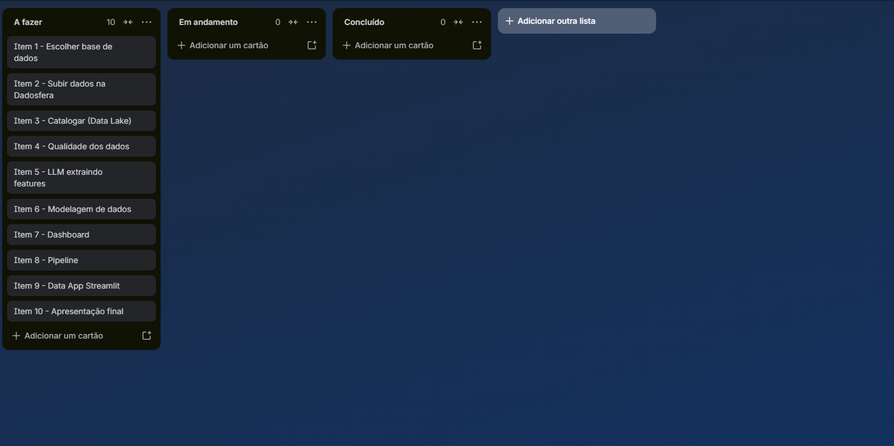
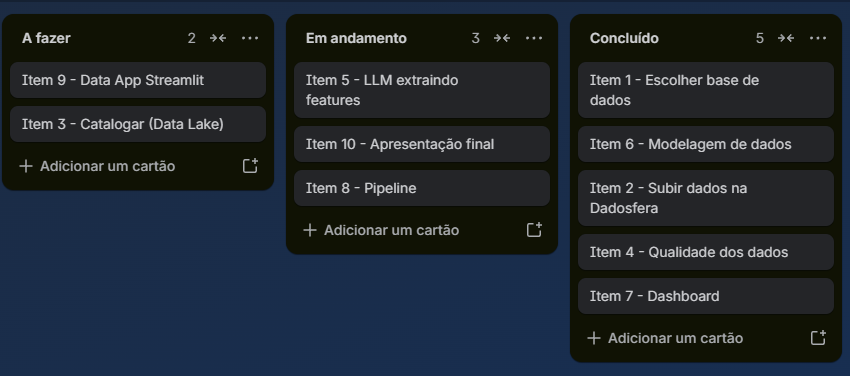
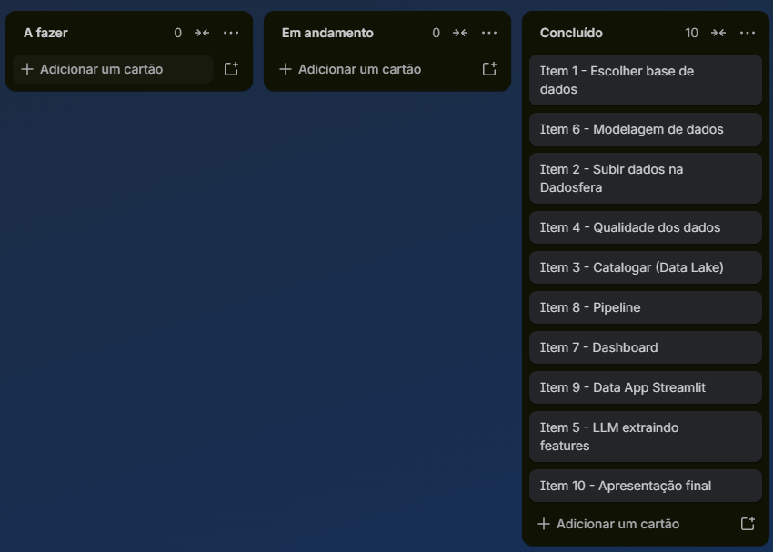

# Item 0 — Planejamento e Agilidade

## Artefato escolhido: Kanban Board

Para representar as etapas do projeto, do início à implementação, foi utilizado um **Kanban board** (via Trello), seguindo a prática ágil de visualização de fluxo de trabalho em colunas: **A Fazer**, **Em Andamento** e **Concluído**.

Cada um dos 10 itens do case foi transformado em um cartão, permitindo acompanhar o progresso real do projeto ao longo de sua execução — o quadro serviu tanto como entrega documental quanto como ferramenta de gestão de fato utilizada durante todo o desenvolvimento do case.

## Evolução do quadro ao longo do projeto

### Início do projeto

Todos os 10 itens do case identificados e organizados na coluna "A Fazer", antes do início da execução.

### Meio do projeto

Com o trabalho em andamento: 5 itens já concluídos (base de dados, upload, qualidade de dados, modelagem e dashboard), 3 em andamento (LLM, pipeline e apresentação) e 2 ainda pendentes (catalogação avançada e data app).

### Final do projeto

Todos os 10 itens movidos para a coluna "Concluído", representando a finalização de todo o escopo do case.

## Observações

- O quadro foi mantido atualizado manualmente ao longo do desenvolvimento, movendo cada cartão conforme o item avançava de fase.
- Essa abordagem permitiu identificar, ao longo do processo, que alguns itens (como o Item 5, devido a instabilidades de ambiente no Google Colab, e o Item 8, devido a uma limitação de acesso ao Módulo de Inteligência da Dadosfera) exigiram mais idas e vindas do que o previsto inicialmente — um exemplo prático de como o Kanban ajuda a visualizar gargalos durante a execução real de um projeto.
