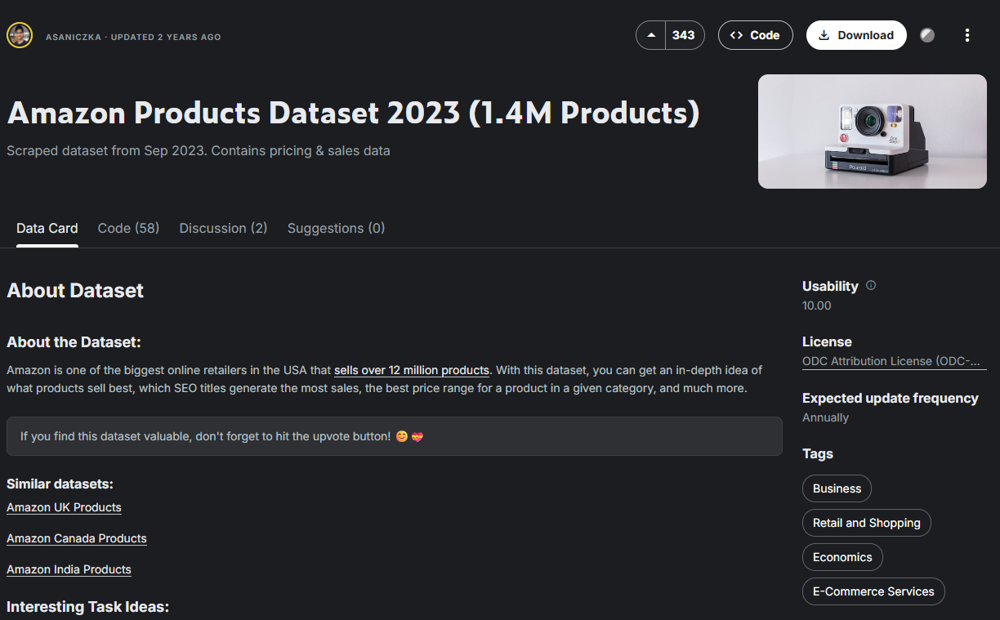
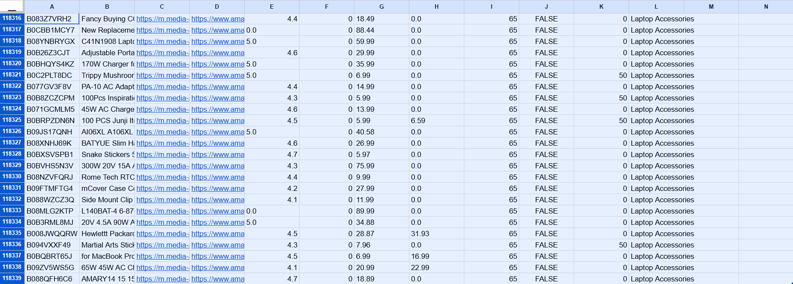

# Item 1 — Sobre a Base de Dados

## Base escolhida

**Amazon Products Dataset 2023** (Kaggle), disponibilizado por asaniczka — contendo aproximadamente 1,4 milhão de produtos reais da Amazon, coletados via scraping em setembro de 2023.

Fonte: https://www.kaggle.com/datasets/asaniczka/amazon-products-dataset-2023-1-4m-products

Esta base **não está entre as sugeridas no documento original do case** (AdventureWorks, NYC Taxi, product-search-corpus), sendo trazida como contribuição adicional, conforme incentivado no item: *"bases não sugeridas aqui serão tratadas como bônus"*.

## Justificativa da escolha

A base foi escolhida por alinhamento direto com minha experiência prévia em produtos de computador e hardware, conforme recomendado pelo documento do case (trazer soluções que eu entenda muito bem e saiba aplicar, já que isso é cobrado na entrevista técnica).

O dataset completo cobre múltiplas categorias de e-commerce. Para este case, foi aplicado um filtro específico, mantendo apenas as categorias relacionadas a **hardware, computadores e eletrônicos de consumo**:

- Computer Servers, Data Storage, Computer Monitors, Computers & Tablets, Computer Networking, Computer Components, Tablet Accessories, Laptop Accessories, Computer External Components, Wearable Technology, Headphones & Earbuds, Office Electronics, Computers, Laptop Bags, Industrial Hardware, Electronic Components, Hardware, Virtual Reality Hardware & Accessories, PC Games & Accessories.

## Volume final

Após o filtro por categoria, a base resultante (`produtos_hardware_eletronicos.csv`) contém:

- **118.338 produtos** (acima do mínimo de 100.000 registros exigido pelo item)
- **19 categorias** distintas dentro do domínio de hardware/eletrônicos
- **11 colunas originais**: `asin`, `title`, `imgUrl`, `productURL`, `stars`, `reviews`, `price`, `listPrice`, `category_id`, `isBestSeller`, `boughtInLastMonth` (+ `category_name`, adicionada no processo de filtro)

## Encaixe com a narrativa do case

A base se encaixa diretamente na narrativa proposta: uma grande empresa de e-commerce buscando centralizar dados para gerar análises descritivas e prescritivas. Neste caso, especificamente um e-commerce especializado em produtos de tecnologia/hardware, domínio que eu já conheço bem o suficiente para propor análises, identificar inconsistências relevantes de qualidade de dados e sugerir features com significado técnico real (ex: tipo de conectividade, categoria de componente, público-alvo).

## Processo de filtragem (reprodutível)

O filtro foi aplicado via script Python, cruzando o arquivo de categorias (`amazon_categories.csv`) com o arquivo de produtos (`amazon_products.csv`), selecionando apenas os `category_id` relacionados ao domínio de hardware/eletrônicos e descartando o restante. O script completo está disponível no notebook do Item 1 (Google Colab).

## Evidência do volume final

Print da planilha final mostrando a última linha do dataset (118.339, contando o cabeçalho — equivalente a 118.338 produtos), confirmando o volume total acima do mínimo exigido:

