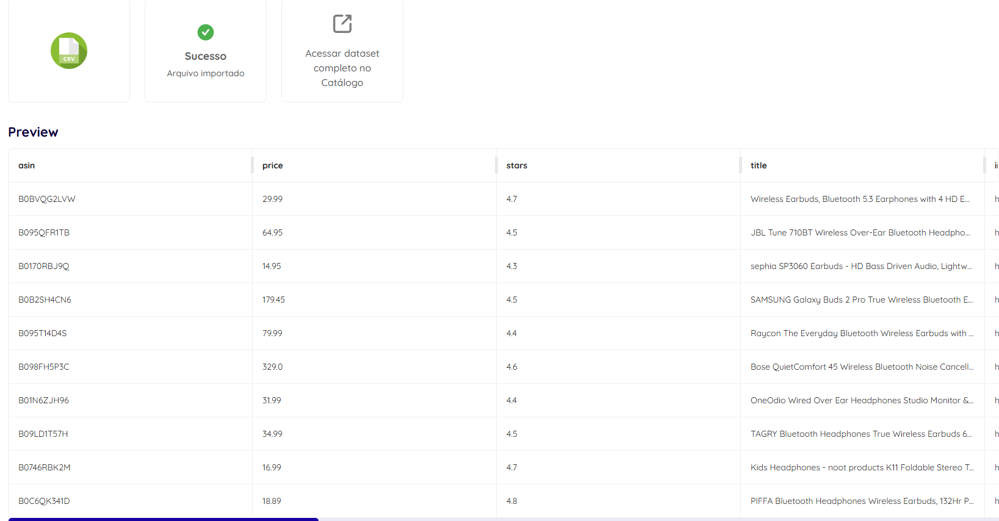
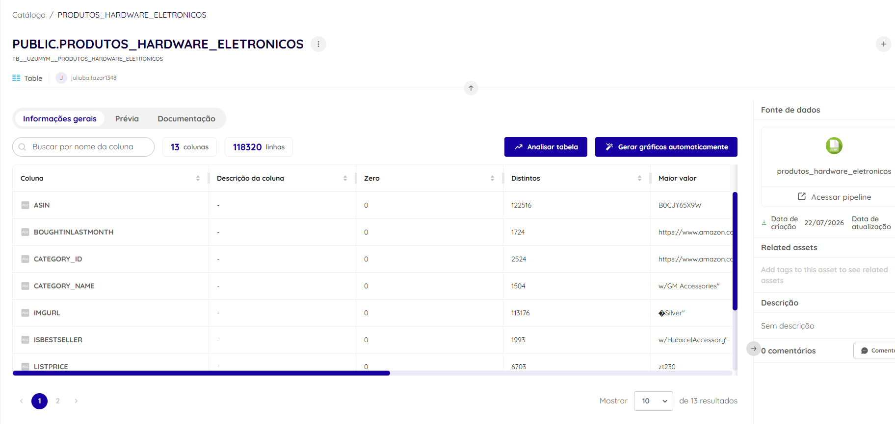

# Item 2 — Sobre a Dadosfera - Integrar

## Processo de carga

Utilizando o módulo de **Coleta** da Dadosfera (Importar Arquivos), foi realizado o upload direto do arquivo `produtos_hardware_eletronicos.csv`, contendo os 118.338 produtos de hardware/eletrônicos filtrados e documentados no [Item 1](../item1/item1_base_dados.md).

Configurações utilizadas na importação:
- Tipo de codificação: UTF-8
- Separador: vírgula (`,`)
- Cabeçalho: ativado (primeira linha reconhecida como nome das colunas)

## Confirmação de sucesso

O upload foi concluído com sucesso, superando o mínimo de 100.000 registros exigido pelo case:

## Prévia dos dados carregados

Após a importação, os dados ficaram disponíveis no Catálogo da Dadosfera, com a tabela `PRODUTOS_HARDWARE_ELETRONICOS` já refletindo a estrutura correta (asin, title, price, stars, entre outras colunas):

## Sobre o bônus de Microtransformação

O bônus deste item (*"para bases de dados Transacionais, temos a feature de Microtransformação. Carregue seus dados numa base transacional SQL, importe para a Dadosfera e aplique uma microtransformação"*) não foi aplicado neste case: a base utilizada é um catálogo de produtos (analítica, não transacional), e o ambiente de treinamento disponibilizado não incluía acesso a um banco de dados SQL transacional configurável para esse fim. Optou-se por concentrar o esforço nos itens de qualidade de dados (Item 4) e modelagem dimensional (Item 6), que cobrem transformação de dados de forma equivalente dentro do escopo obrigatório do case.
