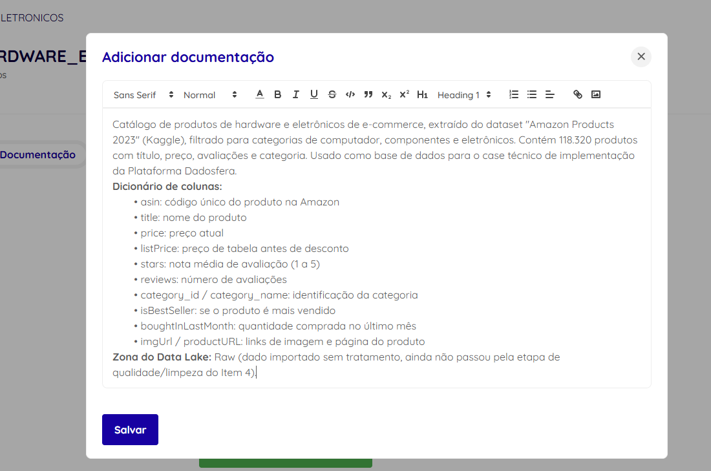

# Item 3 — Sobre a Dadosfera - Explorar (Catalogação)

## Objetivo

Catalogar a base de produtos carregada no Item 2, documentando cada coluna segundo boas práticas de Dicionário de Dados, e posicionar o ativo dentro das zonas de organização de um Data Lake.

## Dicionário de Dados — `produtos_hardware_eletronicos`

| Coluna | Tipo | Descrição | Exemplo |
|---|---|---|---|
| `asin` | string | Código único do produto na Amazon (chave primária, sem duplicados) | `B0BVQG2LVW` |
| `title` | string | Nome/título completo do produto | `JBL Tune 710BT Wireless Over-Ear Bluetooth Headphones...` |
| `imgUrl` | string | Link direto para a imagem do produto | `https://m.media-amazon.com/images/...` |
| `productURL` | string | Link para a página do produto na Amazon | `https://www.amazon.com/dp/B0BVQG2LVW` |
| `stars` | float | Nota média de avaliação, escala de 1 a 5 (0 indica ausência de avaliação) | `4.7` |
| `reviews` | int | Número total de avaliações recebidas pelo produto | `1284` |
| `price` | float | Preço atual do produto em dólares (0 indica preço não capturado) | `29.99` |
| `listPrice` | float | Preço de tabela/original antes de desconto (0 quando não há desconto aplicado) | `49.99` |
| `category_id` | int | Código numérico da categoria do produto | `71` |
| `category_name` | string | Nome da categoria (coluna derivada, adicionada no processo de filtro do Item 1) | `Headphones & Earbuds` |
| `isBestSeller` | boolean | Indica se o produto é marcado como mais vendido pela Amazon | `False` |
| `boughtInLastMonth` | int | Quantidade de unidades compradas no último mês | `2000` |

**Total:** 118.338 linhas, 12 colunas, sem valores nulos técnicos (ausência de dado é representada por 0, conforme identificado e tratado no relatório de qualidade — [Item 4](../item4/item4_relatorio_qualidade_dados.md)).

## Organização em zonas de Data Lake

A Dadosfera organiza dados em zonas que representam o grau de tratamento aplicado: **Raw** (bruta), **Trusted** (confiável/tratada) e **Refined** (refinada, pronta para consumo).

### Por que esta tabela está na zona Raw

A tabela `produtos_hardware_eletronicos` corresponde exatamente aos dados como vieram da fonte original (Amazon Products 2023, filtrado por categoria), sem nenhuma limpeza ou transformação aplicada:

- Os 4.362 produtos com preço zerado ainda estão presentes, sem tratamento.
- Os 16.594 produtos sem avaliação ainda estão presentes, sem tratamento.
- Nenhuma flag de qualidade (ex: `preco_indisponivel`) foi adicionada ainda.

### O que moveria este ativo para Trusted

Segundo o plano de tratamento definido no relatório de qualidade (Item 4), a tabela avançaria para Trusted após:
1. Adicionar a flag `preco_indisponivel = true` nos registros com `price = 0`.
2. Tratar `stars = 0` como valor nulo/ausente (não como nota zero) para fins de cálculo de médias.
3. Investigar e corrigir os 5 registros com título anormalmente curto.

### O que moveria o dado para Refined

As tabelas derivadas criadas no Item 6 (`fato_produtos`, `dim_categoria`, `dim_produto`) já representam um passo em direção à zona Refined: são dados reestruturados especificamente para consumo analítico (modelo dimensional, pronto para BI), embora ainda não incorporem os tratamentos de qualidade do item anterior — o que seria o próximo passo de evolução do pipeline em um cenário de produção real.

## Evidência de catalogação na plataforma

A tabela foi catalogada na Dadosfera (aba "Documentação" do ativo), incluindo a descrição geral do dataset e o dicionário de colunas:

