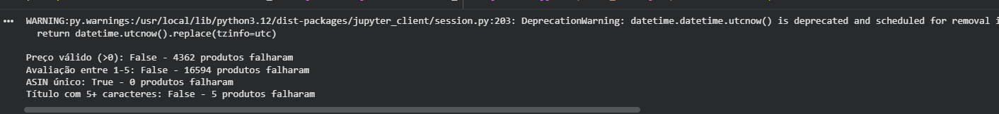

# Item 4 — Relatório de Qualidade de Dados

Este relatório complementa a catalogação da base realizada no [Item 3](../item3/item3_catalogacao.md), detalhando os problemas de qualidade identificados na zona Raw dos dados.

## Base analisada

Dataset `produtos_hardware_eletronicos.csv`, contendo **118.338 produtos** de hardware e eletrônicos, extraídos do dataset público "Amazon Products 2023" (Kaggle) e filtrados por categorias relacionadas a computadores e eletrônicos.

## Ferramenta utilizada

As verificações foram feitas com a biblioteca **great-expectations** (versão 0.15.50), rodando em Python via Google Colab, sobre o DataFrame carregado a partir do CSV.

## Verificações aplicadas e resultados

Resultado da execução das 4 verificações no Google Colab, usando great-expectations:

| # | Verificação | Resultado | Registros que falharam | % da base |
|---|---|---|---|---|
| 1 | Preço deve ser maior que zero (`price > 0`) | ❌ Falhou | 4.362 | 3,7% |
| 2 | Avaliação deve estar entre 1 e 5 (`1 <= stars <= 5`) | ❌ Falhou | 16.594 | 14,0% |
| 3 | ASIN (código do produto) deve ser único, sem duplicados | ✅ Passou | 0 | 0% |
| 4 | Título deve ter no mínimo 5 caracteres | ❌ Falhou | 5 | ~0% |

## Análise e proposta de tratamento

### 1. Preço zerado (4.362 produtos)

Produtos com `price = 0` não têm, na prática, preço zero — o valor zero indica ausência de informação de preço no momento da coleta dos dados.

**Proposta de tratamento:** em vez de excluir esses registros, marcar com uma flag `preco_indisponivel = true`. Isso preserva o produto para análises de catálogo (categoria, título, avaliação) e o exclui automaticamente de análises financeiras (ticket médio, receita estimada, comparação de preços), evitando que o zero distorça médias e somas.

### 2. Avaliação zerada / ausente (16.594 produtos)

Produtos sem nenhuma avaliação (`stars = 0`) são, em geral, produtos novos ou com baixo volume de vendas que ainda não acumularam reviews. Isso é um padrão esperado em qualquer catálogo de e-commerce, não necessariamente um erro de coleta.

**Proposta de tratamento:** tratar como "sem avaliação" (valor nulo/NA), em vez de nota zero, em qualquer cálculo de média de avaliação por categoria ou por marca. Isso evita que produtos sem review puxem a nota média da categoria para baixo artificialmente.

### 3. ASIN duplicado (0 produtos)

Não foram encontradas duplicatas de identificador de produto. A base está íntegra nesse aspecto — nenhuma ação necessária.

### 4. Título muito curto (5 produtos)

Um número pequeno de produtos (5) tem título com menos de 5 caracteres, o que pode indicar erro de captura na fonte original (ex: título truncado ou não capturado corretamente).

**Proposta de tratamento:** investigar manualmente esses 5 casos pontuais. Se confirmado erro de captura, os registros devem ser removidos ou ter o título completado a partir da página original do produto (via `productURL`).

## Notebook completo

O notebook original do Google Colab, com todas as células e outputs de execução, está disponível neste repositório: [`item4_qualidade_dados.ipynb`](item4_qualidade_dados.ipynb).

## Conclusão

A base apresenta boa integridade estrutural (sem duplicados), mas tem lacunas de completude em dois campos-chave (preço e avaliação), que afetam cerca de 3,7% e 14% dos registros respectivamente. Nenhum dos problemas encontrados invalida o uso da base — todos podem ser tratados com flags e regras de exclusão específicas por tipo de análise, preservando o volume total do catálogo.
