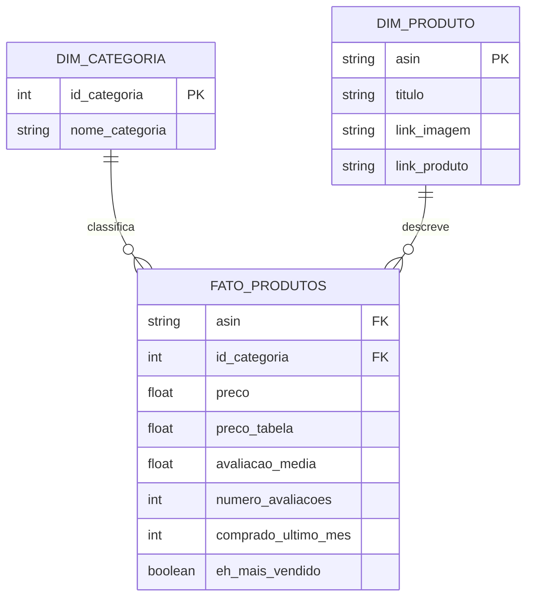
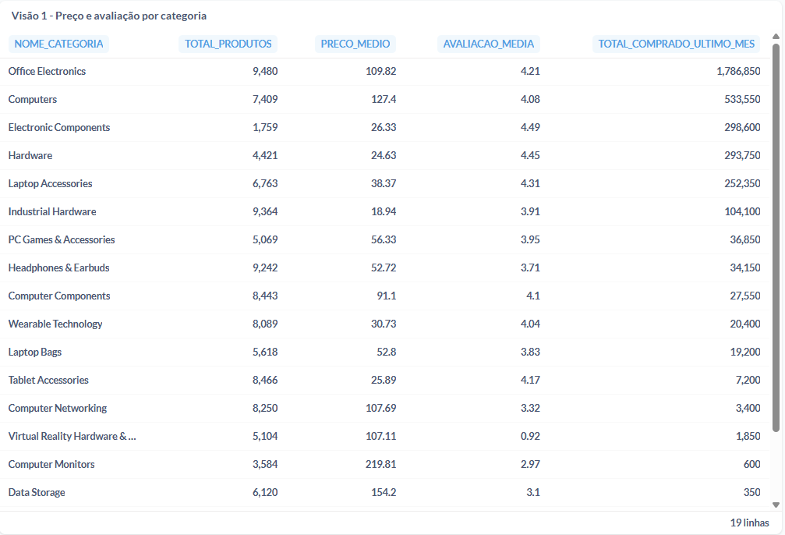
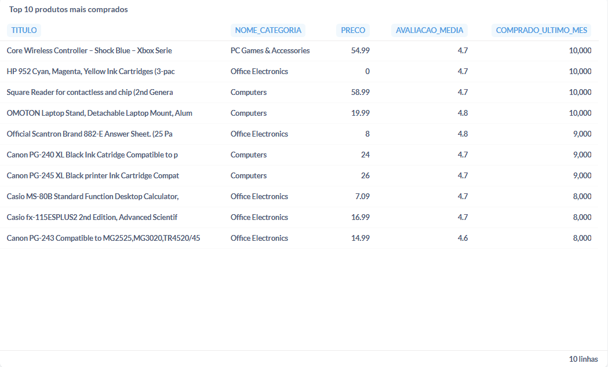

# Item 6 — Modelagem de Dados

## Metodologia escolhida: Kimball (Modelagem Dimensional / Esquema Estrela)

Para este case, optei pela metodologia de **Kimball**, em vez de Data Vault, pelos seguintes motivos:

1. **Natureza do dado**: a base é um catálogo de produtos de e-commerce relativamente estável (não há múltiplas fontes de dados heterogêneas mudando constantemente, cenário onde Data Vault se destaca). Um esquema estrela é suficiente e mais direto para esse volume e complexidade.

2. **Foco em consumo analítico**: o objetivo principal do cliente (e-commerce) é gerar dashboards e relatórios de análise descritiva com agilidade — exatamente o caso de uso para o qual Kimball foi desenhado. O esquema estrela é otimizado para consultas de leitura rápidas (poucos JOINs, agregações simples), o que se traduz diretamente em dashboards mais responsivos.

3. **Simplicidade de manutenção e explicação**: Data Vault introduz conceitos adicionais (hubs, links, satélites) que adicionam complexidade sem trazer benefício proporcional para um catálogo de produtos de porte único, sem histórico de mudanças a rastrear extensivamente.

## Estrutura do modelo

O modelo é composto por 1 tabela fato e 2 tabelas de dimensão:

### Tabela Fato: `fato_produtos`
Contém as métricas quantitativas de cada produto (118.338 registros, um por produto):
- `asin` (chave que conecta com `dim_produto`)
- `id_categoria` (chave que conecta com `dim_categoria`)
- `preco`
- `preco_tabela`
- `avaliacao_media`
- `numero_avaliacoes`
- `comprado_ultimo_mes`
- `eh_mais_vendido`

### Dimensão: `dim_categoria`
Descreve as categorias de produto (19 registros):
- `id_categoria` (chave primária)
- `nome_categoria`

### Dimensão: `dim_produto`
Descreve os atributos textuais/visuais de cada produto (118.338 registros):
- `asin` (chave primária)
- `titulo`
- `link_imagem`
- `link_produto`

## Diagrama do modelo (Esquema Estrela)



A tabela fato fica no centro, conectada às duas dimensões — o formato clássico de "estrela" que dá nome à metodologia.

## As 2 visões finais

### Visão 1 — Preço e avaliação por categoria
Agrega a tabela fato pela dimensão categoria, respondendo: "qual o desempenho médio (preço, avaliação, volume de vendas) de cada categoria de produto?"

```sql
SELECT
    c.NOME_CATEGORIA,
    COUNT(f.ASIN) AS total_produtos,
    ROUND(AVG(f.PRECO), 2) AS preco_medio,
    ROUND(AVG(f.AVALIACAO_MEDIA), 2) AS avaliacao_media,
    SUM(f.COMPRADO_ULTIMO_MES) AS total_comprado_ultimo_mes
FROM fato_produtos f
JOIN dim_categoria c ON f.id_categoria = c.id_categoria
GROUP BY c.NOME_CATEGORIA
ORDER BY total_comprado_ultimo_mes DESC;
```

### Visão 2 — Top 10 produtos mais comprados
Junta fato, produto e categoria no nível de produto individual, respondendo: "quais produtos específicos são os mais vendidos, e em qual categoria/preço/avaliação eles estão?"

```sql
SELECT
    p.TITULO,
    c.NOME_CATEGORIA,
    f.PRECO,
    f.AVALIACAO_MEDIA,
    f.COMPRADO_ULTIMO_MES
FROM fato_produtos f
JOIN dim_produto p ON f.asin = p.asin
JOIN dim_categoria c ON f.id_categoria = c.id_categoria
ORDER BY f.COMPRADO_ULTIMO_MES DESC
LIMIT 10;
```

## Prints dos resultados

### Resultado da Visão 1


### Resultado da Visão 2


## Implementação (além do exigido)

Como demonstração prática do modelo proposto, as 3 tabelas foram efetivamente criadas a partir da base original e carregadas na plataforma Dadosfera, e as 2 visões acima foram executadas com sucesso no módulo de Visualização (Metabase), confirmando que o modelo funciona de ponta a ponta, não apenas na teoria.
