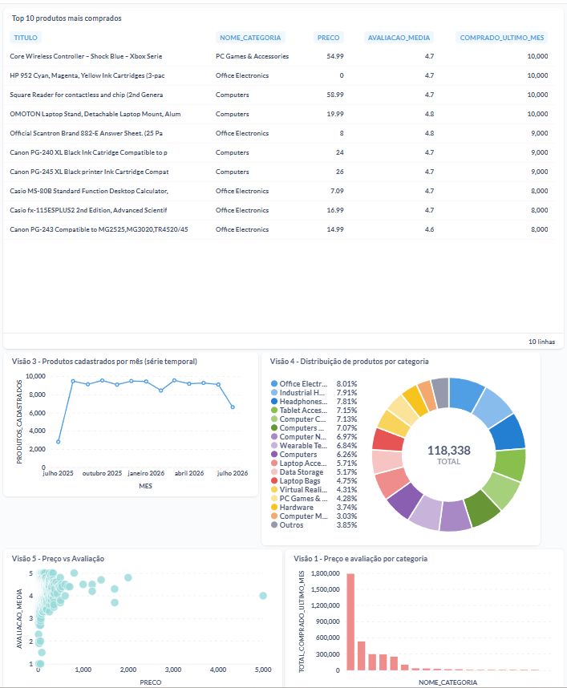

# Item 7 — Dashboard e Visualizações

## Coleção

Criada no Metabase da Dadosfera com o padrão de nome exigido: `Julio Baltazar - 07_2026`.

## As 5 visualizações

### Visão 1 — Volume comprado por categoria (Barra)

Responde: quais categorias têm maior volume de compra no último mês? (Eixo X: `NOME_CATEGORIA`, Eixo Y: `TOTAL_COMPRADO_ULTIMO_MES`)

```sql
SELECT
    c.NOME_CATEGORIA,
    COUNT(f.ASIN) AS total_produtos,
    ROUND(AVG(f.PRECO), 2) AS preco_medio,
    ROUND(AVG(f.AVALIACAO_MEDIA), 2) AS avaliacao_media,
    SUM(f.COMPRADO_ULTIMO_MES) AS total_comprado_ultimo_mes
FROM PUBLIC.TB__M79OIZ__FATO_PRODUTOS f
JOIN PUBLIC.TB__A7CPSY__DIM_CATEGORIA c ON f.ID_CATEGORIA = c.ID_CATEGORIA
GROUP BY c.NOME_CATEGORIA
ORDER BY total_comprado_ultimo_mes DESC;
```

### Visão 2 — Top 10 produtos mais comprados (Tabela)

Responde: quais produtos individuais lideram em volume de compra no último mês?

```sql
SELECT
    p.TITULO,
    c.NOME_CATEGORIA,
    f.PRECO,
    f.AVALIACAO_MEDIA,
    f.COMPRADO_ULTIMO_MES
FROM PUBLIC.TB__M79OIZ__FATO_PRODUTOS f
JOIN PUBLIC.TB__OEDO17__DIM_PRODUTO p ON f.ASIN = p.ASIN
JOIN PUBLIC.TB__A7CPSY__DIM_CATEGORIA c ON f.ID_CATEGORIA = c.ID_CATEGORIA
ORDER BY f.COMPRADO_ULTIMO_MES DESC
LIMIT 10;
```

### Visão 3 — Produtos cadastrados por mês (Linha / Série Temporal)

Responde: como evoluiu o volume de produtos entrando no catálogo ao longo do último ano? Utiliza a coluna de data sintética `data_cadastro`, criada para viabilizar esta análise (a base original não continha histórico real de datas de cadastro).

```sql
SELECT
    DATE_TRUNC('month', TO_DATE(p.DATA_CADASTRO, 'YYYY-MM-DD')) AS mes,
    COUNT(p.ASIN) AS produtos_cadastrados
FROM PUBLIC.TB__QJMRD7__DIM_PRODUTO_V2 p
WHERE p.DATA_CADASTRO REGEXP '^[0-9]{4}-[0-9]{2}-[0-9]{2}$'
GROUP BY mes
ORDER BY mes;
```

*Nota técnica: o filtro `WHERE` foi adicionado para contornar um pequeno número de linhas com desalinhamento de coluna, originado por vírgulas dentro de títulos de produto durante a importação do CSV — o arquivo fonte foi auditado e confirmado correto (365 datas distintas, sem valores fora do padrão); o desalinhamento ocorreu no processo de importação da plataforma.*

### Visão 4 — Distribuição de produtos por categoria (Pizza)

Responde: como o catálogo se distribui proporcionalmente entre as 19 categorias?

```sql
SELECT
    c.NOME_CATEGORIA,
    COUNT(f.ASIN) AS total_produtos
FROM PUBLIC.TB__M79OIZ__FATO_PRODUTOS f
JOIN PUBLIC.TB__A7CPSY__DIM_CATEGORIA c ON f.ID_CATEGORIA = c.ID_CATEGORIA
GROUP BY c.NOME_CATEGORIA
ORDER BY total_produtos DESC;
```

### Visão 5 — Preço vs Avaliação (Dispersão)

Responde: existe relação entre o preço de um produto e sua avaliação média? Produtos sem preço ou sem avaliação (identificados no [relatório de qualidade, Item 4](../item4/item4_relatorio_qualidade_dados.md)) foram excluídos para não distorcer a análise.

```sql
SELECT
    f.PRECO,
    f.AVALIACAO_MEDIA,
    c.NOME_CATEGORIA
FROM PUBLIC.TB__M79OIZ__FATO_PRODUTOS f
JOIN PUBLIC.TB__A7CPSY__DIM_CATEGORIA c ON f.ID_CATEGORIA = c.ID_CATEGORIA
WHERE f.PRECO > 0 AND f.AVALIACAO_MEDIA > 0
LIMIT 5000;
```

## Resumo dos tipos de gráfico utilizados

| Visão | Tipo de gráfico | Categoria da análise |
|---|---|---|
| 1 | Barra | Categorias |
| 2 | Tabela | Produto individual (ranking) |
| 3 | Linha | Série temporal |
| 4 | Pizza | Categorias |
| 5 | Dispersão | Correlação (preço x avaliação) |

## Dashboard final consolidado

As 5 visualizações foram reunidas em um único Dashboard, dentro da Coleção `Julio Baltazar - 07_2026`, no módulo de Visualização (Metabase) da Dadosfera:


