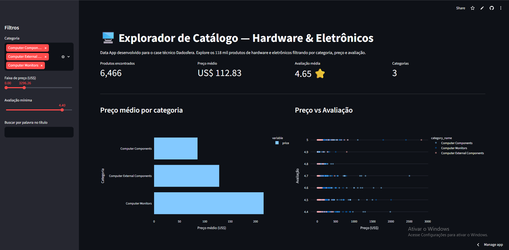

# Item 9 — Data App

## Nota sobre abstração de ambiente

O guia oficial da Dadosfera para subir Data Apps ("Subindo um Data App com Streamlit") utiliza o Módulo de Inteligência como ambiente de hospedagem — módulo que, conforme documentado no [Item 8](../item8/item8_pipeline.md), não está disponível na conta de treinamento utilizada neste case. Seguindo a orientação explícita do documento do case (*"faz parte do processo de avaliação sua capacidade de abstraí-lo para o ambiente sugerido acima"*), o Data App foi publicado diretamente no **Streamlit Community Cloud**.

## O que o app faz

Um explorador interativo do catálogo de 118.338 produtos de hardware/eletrônicos, permitindo:

- Filtrar por categoria (múltipla seleção)
- Filtrar por faixa de preço
- Filtrar por avaliação mínima
- Buscar produtos por palavra-chave no título
- Visualizar métricas gerais (quantidade, preço médio, avaliação média)
- Gráfico de preço médio por categoria
- Gráfico de dispersão preço x avaliação
- Tabela detalhada dos produtos filtrados, ordenada por volume de compra

O app já aplica os filtros de qualidade definidos no Item 4 (remove produtos sem preço e sem avaliação válidos) antes de qualquer análise.

## Arquivos do projeto

```
├── app.py              → código principal do Data App (Streamlit)
├── requirements.txt    → dependências (streamlit, pandas, plotly)
└── produtos_hardware_eletronicos_app.csv → base de dados utilizada (versão reduzida, sem colunas de link, para respeitar o limite de upload do GitHub)
```

## Como rodar localmente

```bash
pip install -r requirements.txt
streamlit run app.py
```

O app abre automaticamente no navegador, geralmente em `http://localhost:8501`.

## Como publicar no Streamlit Community Cloud

1. Suba os arquivos `app.py`, `requirements.txt` e `produtos_hardware_eletronicos_app.csv` para o repositório do GitHub do case (`JULIO_BALTAZAR_DDF_TECH_072026`).
2. Acesse [share.streamlit.io](https://share.streamlit.io) e faça login com sua conta do GitHub.
3. Clique em "New app".
4. Selecione o repositório, a branch (`main`) e o caminho do arquivo principal (`app.py`).
5. Clique em "Deploy". O Streamlit Community Cloud instala as dependências automaticamente a partir do `requirements.txt` e publica o app.
6. Após o deploy, um link público é gerado (formato `https://<nome-do-app>.streamlit.app`) — este link deve ser referenciado neste documento como evidência.

**Link do Data App publicado:** https://juliobaltazarddftech072026-cfdduzvrzjgpauapbsgxwg.streamlit.app/

## Print do Data App em funcionamento


